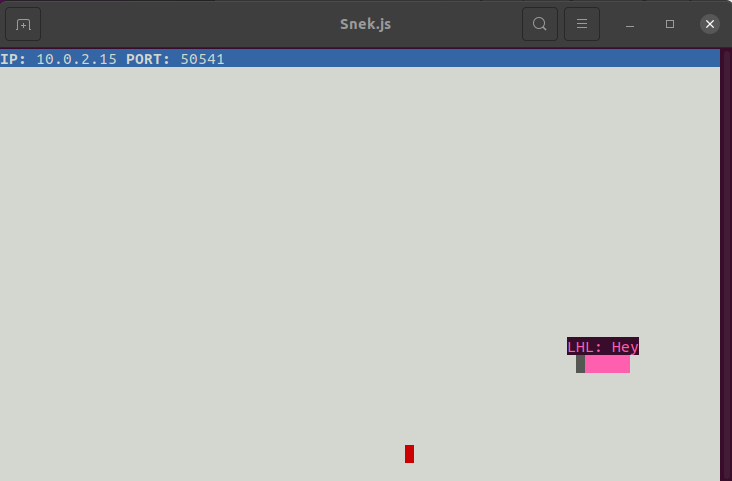
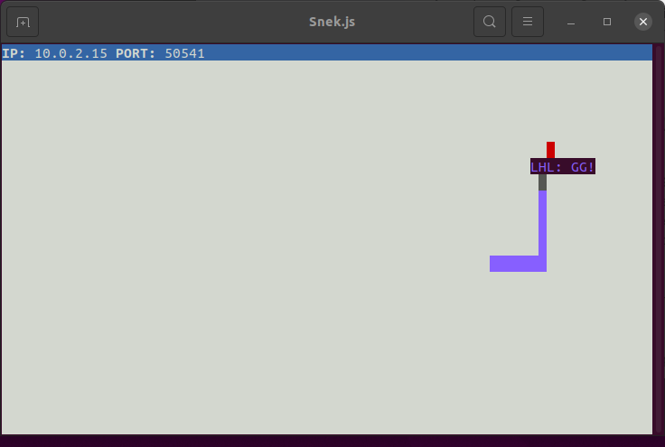

 Snake Client Project

Snake game is a very popular video game. It is a video game concept where the player maneuvers a dot and grows it by ‘eating’ pieces of food. As it moves and eats, it grows and the growing snake becomes an obstacle to smooth maneuvers. The goal is to grow it to become as big as possible without bumping into the side walls, or bumping into itself, upon which it dies.

This is simply a multiplayer take on the genre.

Before you can run this client, you will need to be running the server side which you can download and install from here. 

## Final Product

## Getting Started

- Follow steps inside the snek server repo to run the server side
- Run the development snake client using the `node play.js *Your snake's initials here*` command.

## Snake controls

Press W to move up, A to move left, D to move right, and S to move down.

You can also send a few messages to other players.
- F will send "Oh no!"
- G will send "GG!"
- T will send "Take that!"

## Note

I have added the only server file that I modified to add broadcast message of "A new player has joined!" when another player enters the game. The lines I added are from 67-69.